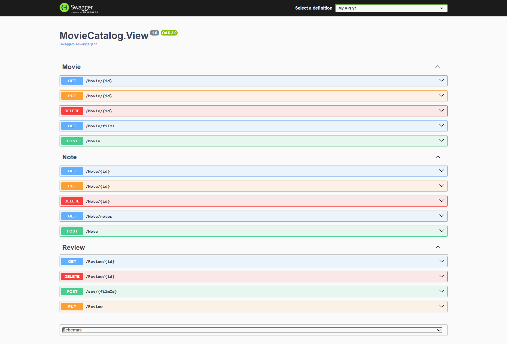
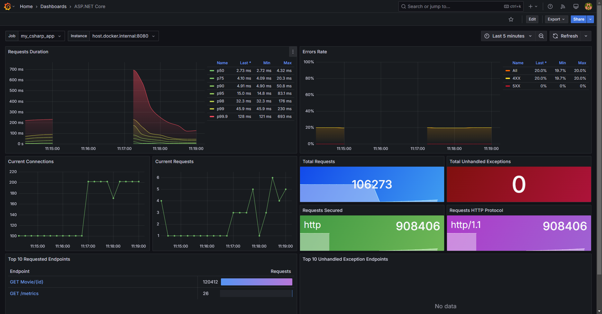
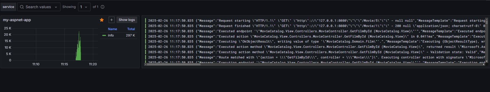
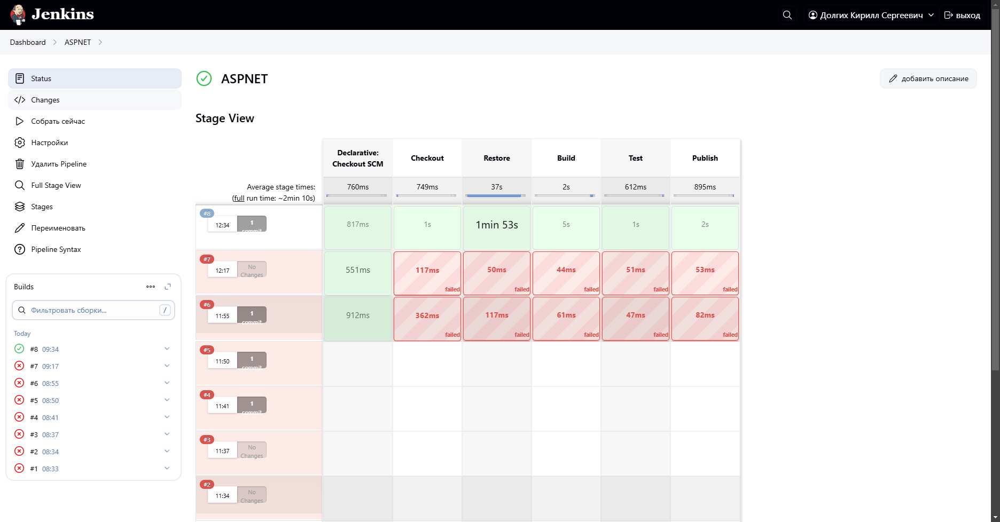

# MovieCatalog

MovieCatalog — это сервис для создания заметок и оценок в ходе просмотра фильма.

## Сборка и запуск

Для сборки и запуска используется `docker-compose`. Выполните команду:

```sh
docker-compose up -d --build
```
## Используемые сервисы

В состав системы входят:
- **Grafana** (порт **3000**) — мониторинг и визуализация метрик.
- **Loki** (порт **3100**) — сбор и хранение логов.
- **Prometheus** (порт **9090**) — система мониторинга и сбора метрик.
- **OpenTelemetry** — инструмент для сбора метрик и трассировки запросов.
## OpenAPI

OpenAPI доступен в виде Swagger и спецификация находится в файле [openapi.yaml](Media/openapi.yaml).
Сервис запускается на порту **8080**.
## API

### Movie
- `GET  /Movie/{id}` — получить фильм по ID.
- `PUT  /Movie/{id}` — обновить данные фильма.
- `DELETE  /Movie/{id}` — удалить фильм.
- `GET /Movie/films` — поиск фильмов с фильтрами.
- `POST /Movie` — создать новый фильм.

### Note
- `GET  /Note/{id}` — получить заметку по ID.
- `PUT /Note/{id}` — обновить заметку.
- `DELETE /Note/{id}` — удалить заметку.
- `GET /Note/notes` — получить список всех заметок.
- `POST /Note` — создать новую заметку.

### Review
- `GET /Review/{id}` — получить отзыв по ID.
- `DELETE /Review/{id}` — удалить отзыв.
- `POST /set/{filmId}` — добавить отзыв к фильму.
- `PUT /Review` — обновить отзыв.



## Метрики

Система собирает метрики для анализа статистики запросов. Используемые метрики:

- **Total Unhandled Exceptions** — количество необработанных исключений.
- **Errors Rate** — соотношение запросов по кодам возврата.
- **Top 10 Requested Endpoints** — список самых популярных эндпоинтов.



## Логи

Логи фильтруются по уровню важности:
- **Info** — информационные сообщения.
- **Warning** — предупреждения.

## CI/CD

В проекте используется **Jenkins**, развернутый на внешней машине.
Jenkins подключается к репозиторию и выполняет **pipeline** для автоматической сборки и развертывания.



